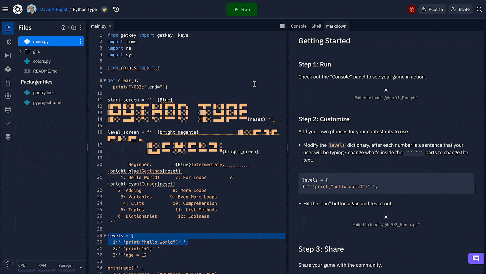
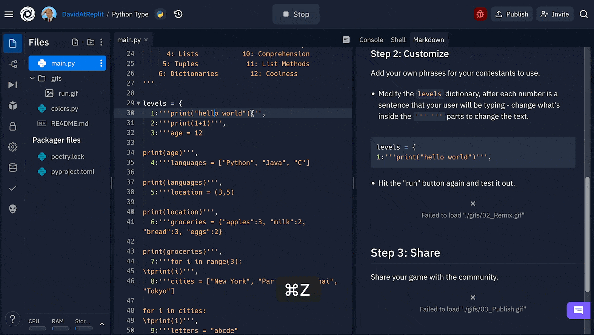
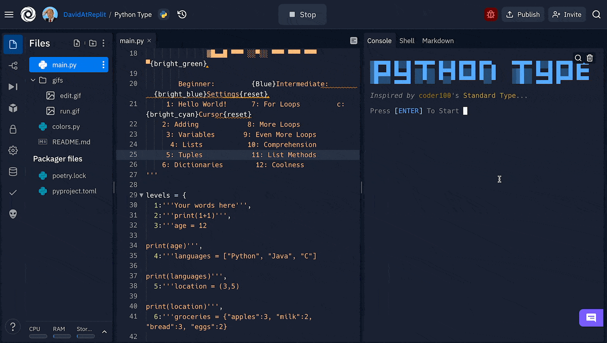
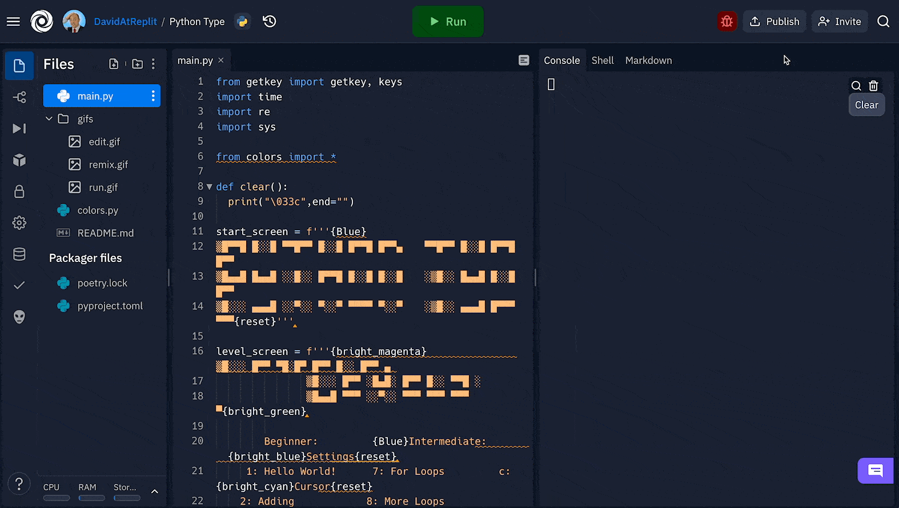

# Make Your Own Typing Tutor

This Typing Tutor Repl is now your own - you can remix it however you want!

## Getting Started

### Step 1: Run

Check out the "Console" panel to see your game in action.



### Step 2: Customize

Add your own phrases for your contestants to use.
  - Modify the `levels` dictionary, after each number is a sentence that your user will be typing - change what's inside the `'''    '''` parts to change the text.
  ```python
  levels = {
  1:'''print("hello world")''',
  ```
  
  
  - Hit the "run" button again and test it out.
  - Don't forget you'll need to select the correct *number* from the menu for the text you changed
    



## Step 3: Share

Share your game with the community.



## Step 4: Remix

Dig into Python [here](https://docs.replit.com/tutorials/building-a-game-with-pygame), why not change up the menu or the difficulty level?

# 🎉 Good work!

# Challenge!
- Can you make it work without caring about capitalisation?


